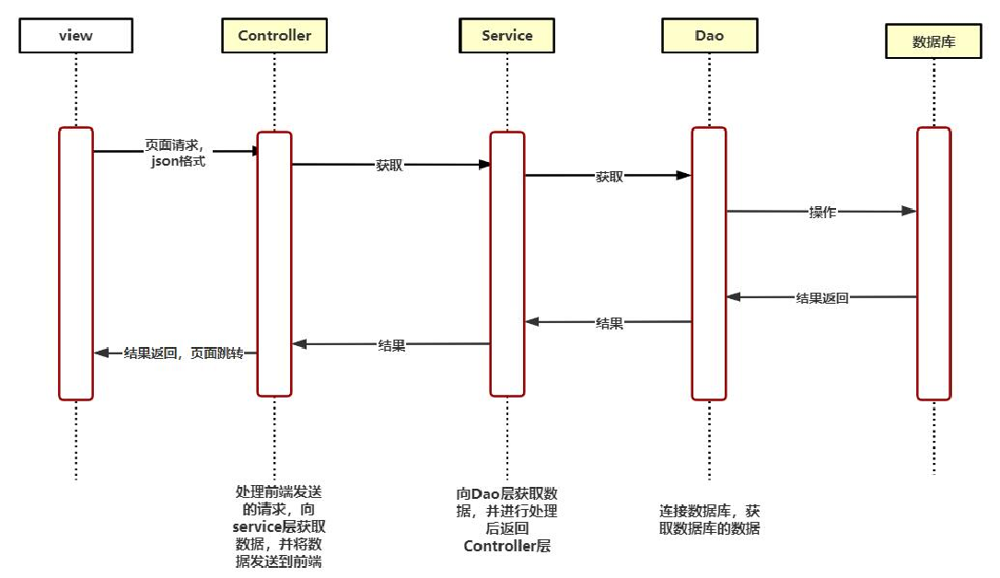
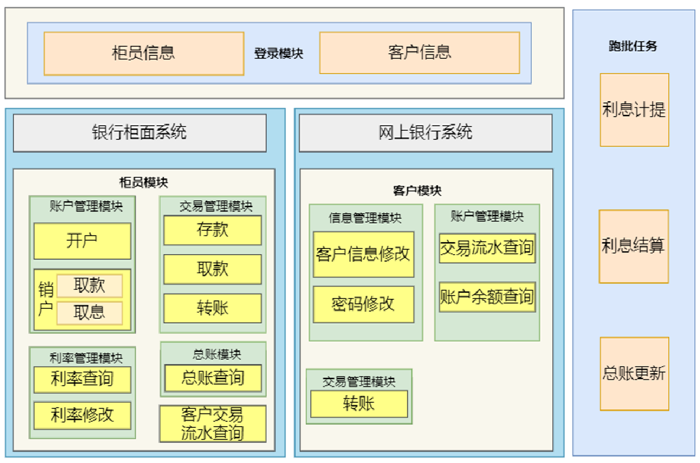
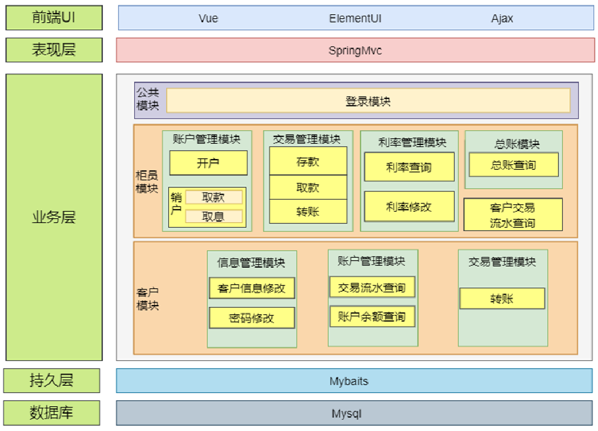

# 银行活期储蓄存款系统

| 文件                            | 说明       |
|-------------------------------|----------|
| config                        | 系统配置     |
| Controller                    | 控制接口层    |
| Dao                           | 数据持久层    |
| entity                        | 响应类、错误类等 |
| po                            | 数据库实体    |
| service                       | 业务逻辑接口   |
| service/impl                  | 业务逻辑接口实现 |
| task                          | 线程任务     |
| utils                         | 工具类      |
| vo                            | 展示层      |
| Application                   | 程序启动入口   |
| resources                     | 资源文件夹    |
| resources/mapper              | sql映射文件  |
| resources/application.yml     | 默认配置文件   |
| resources/application-dev.yml | 开发环境配置文件 |
| test                          | 测试文件     |
| pom.xml                       | maven依赖  |

>系统技术架构：
>1. 前端：vue+elementui
>2. 后端：springboot+mybaits
>3. 数据库：mysql5.7.27
>4. 整体项目：前后端分离模式
>5. 其他：使用maven进行jar包依赖，前端使用axios进行json格式数据的发送，后端通过controller层进行接收。
>6. 系统技术架构图
>

>系统功能架构图：
>
>
