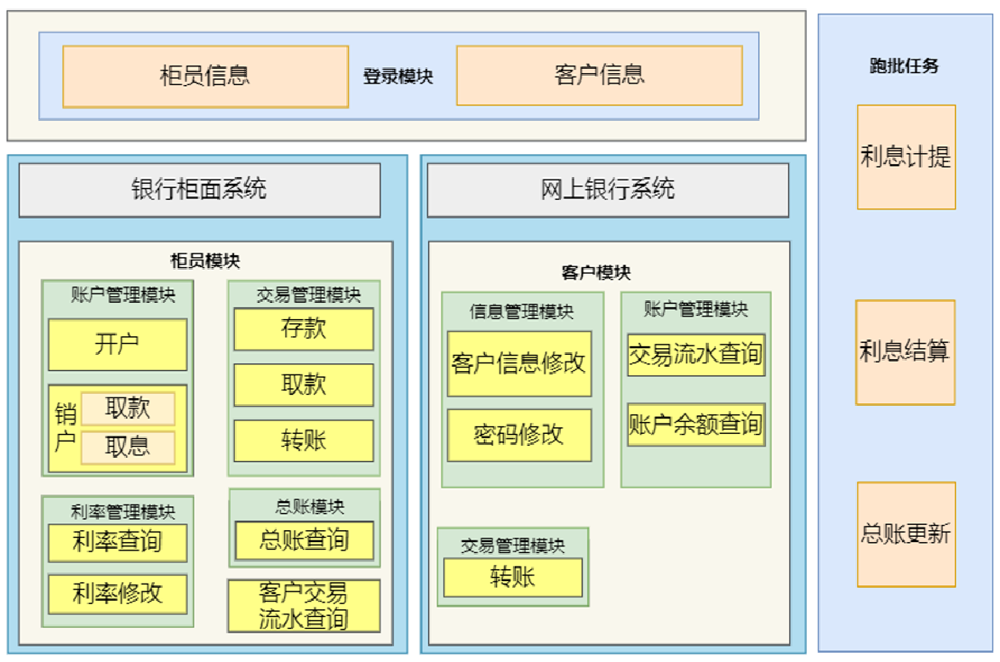
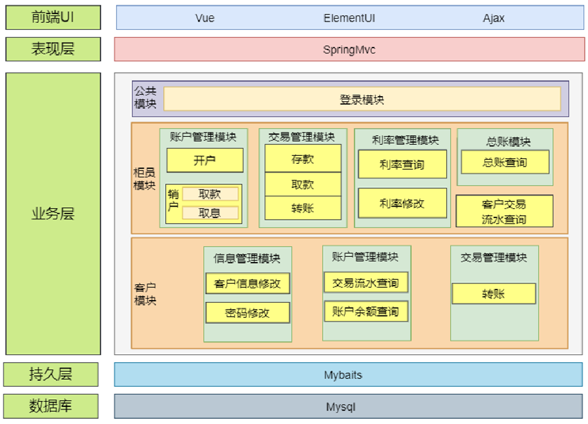

# 银行活期储蓄存款系统

| 文件                     | 说明           |
|------------------------|--------------|
| api/v1                 | 接口文件         |
| cmd                    | main函数程序启动入口 |
| config                 | 配置文件         |
| internal               | 程序主体         |
| internal/cache         | redis缓存      |
| internal/dao           | 数据持久层        |
| internal/dto           | 数据传输层        |
| internal/initialize    | 初始化mysql文件   |
| internal/middleware    | 中间件          |
| internal/model         | 数据库实体        |
| internal/pkg           | 工具类          |
| internal/pkg/e         | 响应码          |
| internal/pkg/res       | 响应类          |
| internal/pkg/util      | 工具类          |
| internal/rabbitMQ      | 消息队列         |
| internal/service       | 业务逻辑层        |
| internal/vo            | 视图层          |
| rabbitMQServer         | 消息队列服务       |
| rabbitMQServer/cmd     | 服务启动入口       | 
| rabbitMQServer/service | 消费者业务逻辑层     |
| router                 | 路由           |
| go.mod                 | 依赖           |

>系统技术架构：
>>1. 前端：vue+elementui
>>2. 后端：springboot+mybaits
>>3. 数据库：mysql5.7.27
>>4. 整体项目：前后端分离模式
>>5. 其他：使用maven进行jar包依赖，前端使用axios进行json格式数据的发送，后端通过controller层进行接收。
>>6. 系统技术架构图
>>

>系统功能架构图：
>
>